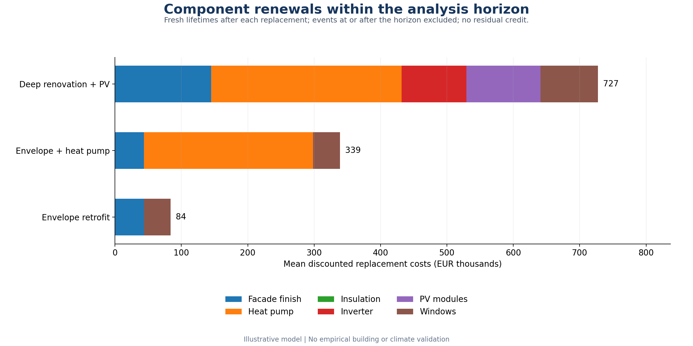

# Uncertainty-aware life-cycle modelling for building renovation

**Parisa Hosseini | Python research demonstrator | v2.1 | September 2026**

A reproducible computational example comparing three illustrative renovation
packages with an explicit reference across owner, tenant and combined-private
perspectives. The model combines Monte Carlo life-cycle costing, uncertain
component renewals, stakeholder accounting, fixed-anchor preference diagnostics,
sample-size and seed checks, and an external performance-stress interface.

The purpose is to demonstrate modelling readiness and transparent reasoning.
All building budgets, lifetime ranges, multipliers and thresholds are illustrative.
This is not a calibrated building model or an empirical climate-resilience study.

## Results snapshot



The committed summary tables and figures reproduce the documented v2.1 run.
Large row-level simulation files are intentionally not stored in the repository;
they are regenerated by `python renovation_lcc.py` and excluded through
`.gitignore`.

## Inspect the evidence

- `outputs/analysis_report.txt`: numerical findings and qualifications.
- `outputs/scenario_summary.csv`: individual metrics first; optional preferences last.
- `outputs/lifecycle_replacement_costs.png`: the economic effect of component renewals.
- `outputs/convergence_plot.png`: sample-size and independent-seed comparisons.
- `outputs/climate_stress_thresholds.png`: a conditional proxy screen, not a comfort assessment.
- `VALIDATION.md`: tests, numerical checks and reproducibility qualifications.
- `ASSUMPTIONS.md`: accounting boundary, assumptions and scientific limitations.

## Run and reproduce

The delivered run used Python 3.12 and the exact versions recorded in
`requirements-reproduced.txt`. Prefer a fresh environment:

```sh
python3 -m venv .venv
source .venv/bin/activate
python -m pip install -r requirements-reproduced.txt
python -m unittest discover -s tests -v
python renovation_lcc.py
```

Windows activation: `.venv\Scripts\activate`.
`requirements.txt` specifies compatible ranges for other environments; it is not
the exact reproducibility lock. Python 3.10+ is supported by the source syntax,
but exact pinned packages may require a newer interpreter/platform.

```sh
python renovation_lcc.py --input inputs/renovation_scenarios.csv \
  --components inputs/components.csv --config inputs/model_config.json \
  --stress-cases inputs/climate_stress_scenarios.csv \
  --simulations 10000 --seed 20260726 --output-dir outputs_new
```

`--no-charts` avoids Matplotlib imports; `--skip-convergence` omits the expensive
multi-size/seed diagnostic. Neither option is used for the delivered full run.
Use a fresh output folder for each experiment to avoid confusing older files
with the current run. Convergence sizes and seeds are configured separately
from the main-run `--simulations` and `--seed`.

## Accounting and time

Every scenario input is a difference from the reference. Zero reference cash
flows do not mean an existing building has no operating expenses. The example
assumes the reference is admissible; regulations and minimum intervention
requirements have not been assessed.

```text
E = present value of avoided energy bills
R = present value of additional rent transferred from tenant to owner
V = discounted terminal property premium
C = initial investment after grants
M = discounted incremental routine maintenance
Q = discounted incremental component renewal costs
a = owner's share of E (default 0: tenants pay the energy bills)

Owner            = a E + R + V - C - M - Q
Tenant           = (1-a) E - R
Combined private = E + V - C - M - Q = Owner + Tenant
```

Public grants remain external benefits to the private boundary. This is not a
social-welfare account. Initial and replacement costs are paid by the owner;
grants apply only to the initial investment. Cash flows are nominal EUR,
discounted to time zero. Routine annual amounts are year-1 end-of-year amounts.

## Component renewal model

`components.csv` decomposes the original illustrative investment and maintenance
budgets. These totals must reconcile to each scenario; they are not charged a
second time. Replacement costs are additional and have a separate output column.
They represent assumed **incremental renewal obligations**, not a validated bill
of materials or gross replacement costs for an actual building.
The summary column `mean_pv_replacement_cost_eur` describes the package cost in
every perspective's row; it is charged only to owner and combined private NPV,
and is not a tenant expense.

For each component and future, a service life is sampled. A life ending strictly
before the horizon triggers immediate replacement; the renewed component receives
a fresh lifetime, allowing multiple renewals. Costs are escalated to the event
time and discounted to zero. A life ending exactly at the horizon is excluded.
The schedule uses continuous years. No downtime, repair states or physical
degradation is simulated.

The `uncertainty_key` couples equal component types across packages with common
random quantiles. Different keys and successive renewals have independent
streams. Thus, removing or reordering a package does not redraw other components.
No component-specific residual-value credit is applied. The hypothetical property
premium is separate; its adequacy must be reconsidered when building a real case.

## Primary decision evidence

Read median NPV, positive-outcome frequency, lower-tail mean, P95 regret and
best-option share together. `pareto_on_core_metrics` identifies nondominated
eligible options on three maximized metrics: median, positive frequency and
lower-tail mean. This Pareto definition does not imply dominance on every possible
economic, environmental or stakeholder objective.

- `probability_positive`: empirical NPV > 0 frequency.
- `probability_nonnegative`: empirical NPV >= 0 frequency, reported separately.
- `worst_decile_mean_eur`: mean of the lowest 10% empirical probability mass.
- `p95_regret_eur`: P95 of best eligible NPV minus the option NPV within each future.
- `best_option_share`: share of best outcomes, splitting numerical ties.

Regret and best-option share inherently depend on the comparison set. Removing
an option can change these quantities legitimately. They are not inputs to the
new preference score.

## Optional fixed-anchor preference diagnostic

`preference_based_score` combines clipped linear utilities on positive frequency,
lower-tail mean and median. `conditional_preference_rank` is optional, not the
headline finding. The default weights are 0.30 / 0.35 / 0.35.

| Metric | Fixed utility 0 anchor | Fixed utility 1 anchor |
|---|---:|---:|
| Positive frequency | 0 | 1 |
| Worst-decile mean | EUR -750,000 | EUR 0 |
| Median NPV | EUR -500,000 | EUR +500,000 |

These round building-budget-scale anchors were declared before inspecting V2.1
results. They are illustrative floor/aspiration preferences, not elicited utility
values, regulatory thresholds or empirical calibration. Values outside each
range saturate at 0 or 1. Changing the building scale requires reviewing them.

The zero reference receives no positive-frequency utility bonus. It can still
be attractive on downside and median criteria. For unchanged outcome distributions,
anchors and weights, removing or adding alternatives cannot change a retained
option's score or reverse its pairwise preference order. Ordinal rank numbers
can move as the population changes. Ties use a 12-decimal score comparison.

`option_set_sensitivity.csv` checks removal of each option, addition of copies,
and addition of a deliberately dominated synthetic alternative. These artificial
additions are numerical diagnostics, not extra construction designs. Live-set
regret/Pareto membership may change while the independent score stays fixed.

## Monte Carlo convergence diagnostics

The default grid is 1,000 / 2,500 / 5,000 / 10,000 / 25,000 draws under five
independent seeds. Economic parameters and lifetime streams are independently
keyed; samples at smaller N are exact prefixes of larger samples for the same
seed. The lifetime streams have the same property.

For each option, perspective and seed, the diagnostic records mean NPV, positive
frequency, P10, lower-tail mean, P95 regret and optional preference rank. It compares
each smaller N with the 25,000-draw result from that seed. The largest run is a
finite comparator, not truth. Cross-seed ranges are also saved; graph bands show
observed seed ranges, not confidence intervals.

Declared tolerances are EUR 10,000 for mean, 1 percentage point for positive
frequency, EUR 20,000 for P10 and EUR 30,000 for both lower-tail mean and P95 regret.
They are numerical precision targets for this illustrative budget, not guarantees.
Largest-N rows are marked as comparators, not counted as converged by construction.
Wilson intervals apply only to Monte Carlo positive-outcome frequencies conditional
on the specified model, not to real-world certainty or uncertain input validity.

## External performance-stress interface

The delivered CSV contains four **hypothetical proxy cases**. No case label is a
historical dataset, warming level, RCP/SSP pathway or predicted frequency.
It supports a `*` default plus optional per-scenario overrides.

Case inputs multiply retained annual energy savings, equipment performance,
routine maintenance and terminal premiums. An energy-disruption case uses a
uniform savings-factor range. Common uniforms and unchanged renewal paths provide
paired comparisons. Climate effects on lifetimes and replacement costs are not
inferred from case labels.

The retained-savings proxy is `sampled performance factor * energy-savings multiplier
* equipment-performance multiplier`, relative to the scenario's assumed nominal
annual savings. Separate multipliers should only be populated from an external
model when their meanings are distinct to avoid counting an effect twice.

The configurable screen requires median NPV >= EUR 0, positive frequency >= 70%,
P95 regret <= EUR 500,000, and at least 90% of draws retaining 75% of assumed annual
savings. An option is flagged `robust_across_stress_cases` only when both financial
and proxy-performance screens pass in at least three of the four cases.
Cases are unweighted; 3/4 is not a 75% probability of real-world success.

The reference has no incremental savings target, so its performance screen is
N/A, not an automatic pass. The financial and performance screens have explicit
separate outputs. Failure of all alternatives is an informative result and is
not corrected by adjusting inputs to produce a winner.

An actual building-simulation integration would require documented scenario
provenance, units, baselines and mapping of outputs. Indoor comfort needs its own
physical output and threshold; the current proxy must not be called thermal comfort.

## Other sensitivity diagnostics retained from V2

- Economic OAT: sampled P10/P90 inputs, with other economics at medians and all
  component lifetimes at their modes. It does not decompose lifetime effects or interactions.
- Spearman associations: ranked economic inputs versus sampled total NPV including
  renewals. These are not causal effects or variance-based indices.
- Five preference-weight profiles and owner energy-savings shares 0% / 50% / 100%.
- Paired accounting stress cases: no grants, no rent uplift, no terminal premium,
  and reduced energy price with higher capital costs. Renewal costs are included.

## Repository structure

```text
.
├── inputs/                    # illustrative model inputs and stress cases
├── outputs/                   # committed summaries and figures
├── provenance/v2/            # archived source/configuration snapshot
├── tests/                     # unit and integration tests
├── renovation_lcc.py          # command-line entry point and core economics
├── component_lifecycle.py     # stochastic lifetime and renewal schedules
├── convergence.py             # nested sample-size and seed diagnostics
├── robustness.py              # fixed-anchor and option-set diagnostics
└── performance_stress.py      # external stress/performance interface
```

## Outputs

| Output | Purpose |
|---|---|
| scenario_summary.csv | Individual outcome metrics, Pareto flag and optional preference score |
| simulation_results.csv | All main-run futures/options and stakeholder cash flows |
| sampled_futures.csv | All economic draws |
| component_lifecycle_draws.csv | First life, renewal count and PV cost per future/component |
| lifecycle_replacements.csv | Each renewal time, preceding life, nominal and discounted cost |
| component_summary.csv | Aggregate renewal statistics |
| option_set_sensitivity.csv | Score/order checks under removal/addition diagnostics |
| monte_carlo_convergence.csv | Nested-N comparisons, Wilson intervals and tolerance checks |
| seed_stability.csv | Cross-seed ranges and optional first-rank counts |
| climate_stress_summary.csv | Financial and proxy-performance outcomes by case |
| robust_across_stress_cases.csv | Conditional count-based proxy screen |
| sensitivity_oat.csv / sensitivity_rank_correlations.csv | Economic-input diagnostics |
| weight_sensitivity.csv / allocation_sensitivity.csv | Preferences and benefit allocation |
| stress_test_summary.csv | Accounting/input stresses with component renewals |
| resolved_*.csv / resolved_config.json | Inputs actually used |
| run_manifest.json | Versions, hashes, seed and sampling scheme |

The charts are supplied as PNG and SVG. `VALIDATION.md` records the verification
results. `SHA256SUMS.txt` covers the release files. V2 source/configuration are
preserved under `provenance/v2/` for traceability. See `outputs/README.md` for the
distinction between committed evidence and regenerated row-level data.

## Scope and next research steps

Further work should be driven by access to building data or a concrete research
question. Calibration against real buildings, direct climate/building simulation,
indoor-comfort outputs, environmental LCA and empirical validation are outside
this version.

## Author and citation

Developed by **Parisa Hosseini**. Research profiles:
[ORCID](https://orcid.org/0009-0009-0168-8912),
[Google Scholar](https://scholar.google.com/citations?user=L2dOgkkAAAAJ&hl=en), and
[LinkedIn](https://www.linkedin.com/in/parisa-hosseini-216886310).

Citation metadata are provided in `CITATION.cff`. The code is released under the
MIT License. The project was iteratively developed and reviewed with AI-assisted
debugging and documentation support; the author is responsible for the modelling
choices, verification and interpretation.
